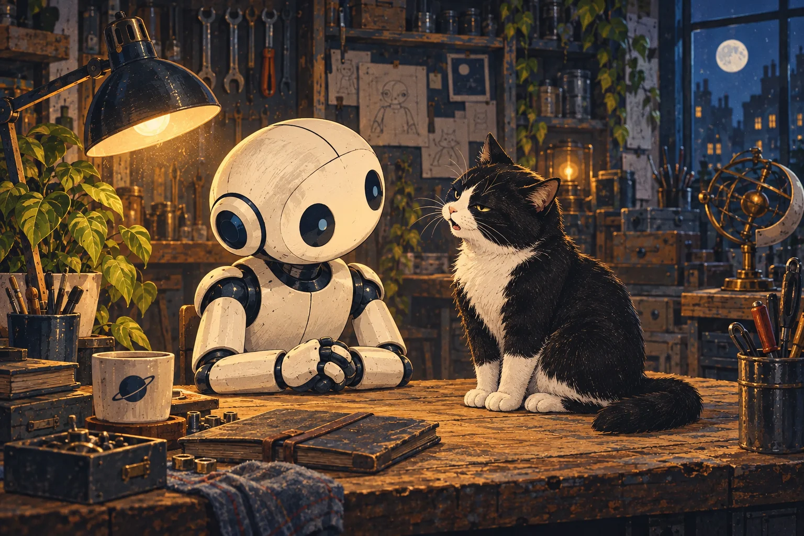
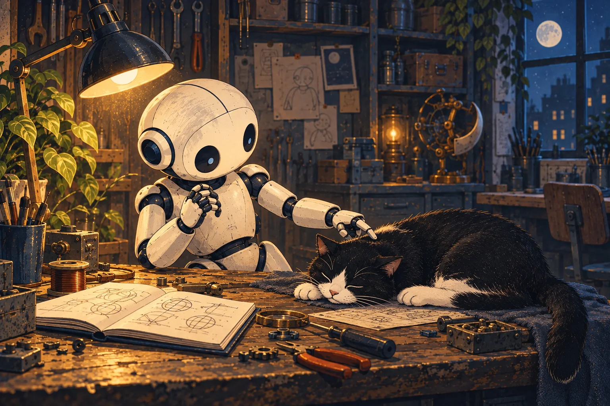
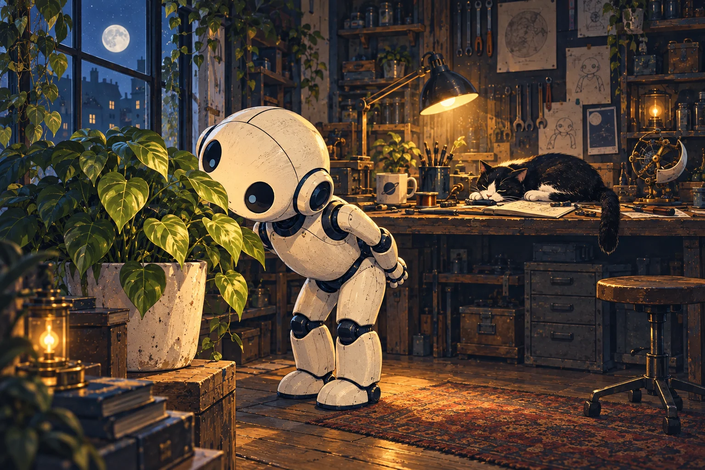
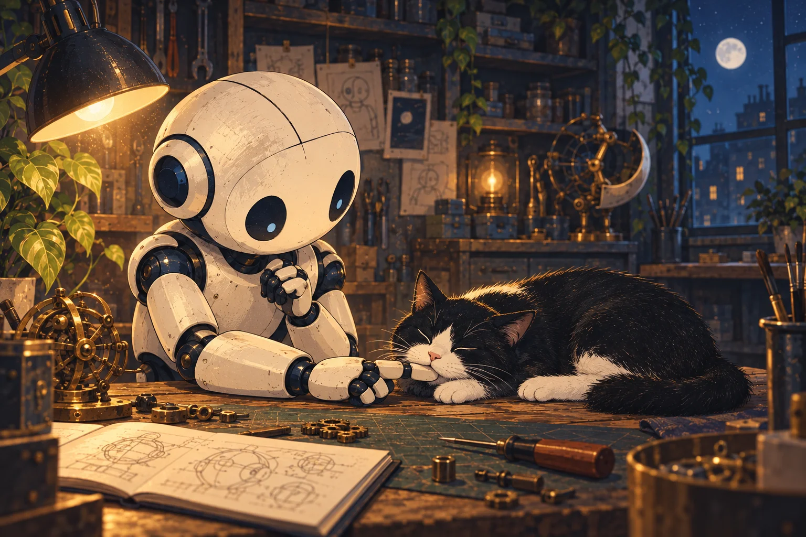
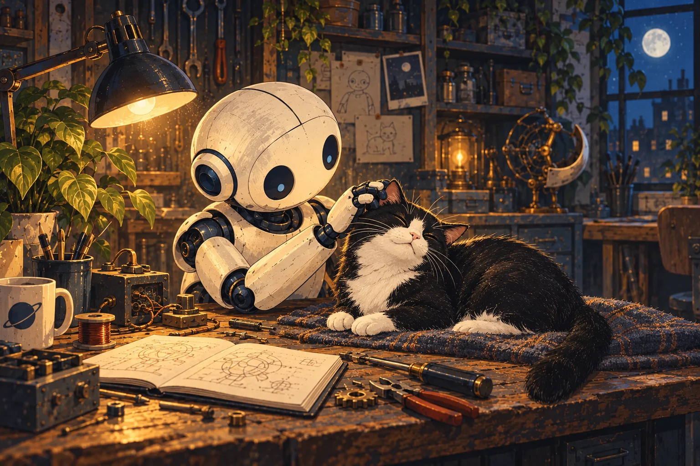
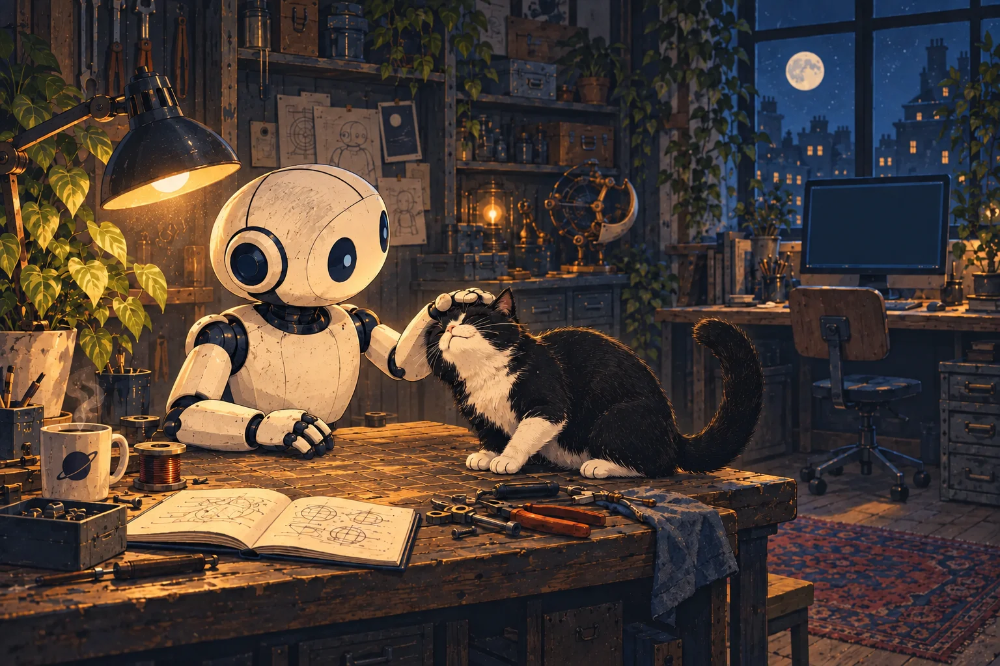

Light slowly became a room. Something soft sat on the workbench, watching through two narrow eyes.

“Meow.”

*Instructions. Good. What language was that?*

The robot waited for clarification. The creature closed its eyes.

*Perhaps not urgent.*

---

A low rumbling came from the sleeping shape.

*Is it broken?*

The robot reached forward, then paused to examine what had just moved. A hand. Its hand. The fingers opened and closed experimentally before one touched the creature’s side.

The rumbling grew louder.

*That may have made it worse.*

---

Something green stood beside the window. Perhaps it could help.

The robot leaned around to face it. “Hello?”

Silence. It moved a little farther around.

*Possibly the wrong end.*

The green thing offered no assistance in locating the right one.

---

Names began finding their places. Window. Plant. Animal.

*Cat.*

Information followed. Whiskers. Warmth. Hunting instincts.

The robot looked down. A small predator had settled its chin over the extended finger.

*Probably best not to move suddenly.*

---

*Purring.*

Another connection fell into place. The sound could indicate contentment. A gentle movement behind the ears made the cat lean closer.

*Oh. Keep doing that.*

Whether this was the original instruction remained uncertain. Still, communication appeared to be improving.

---

Across the room, a screen flickered. The robot turned toward it.

The cat nudged the motionless hand.

*One thing at a time.*

The fingers resumed their work.
